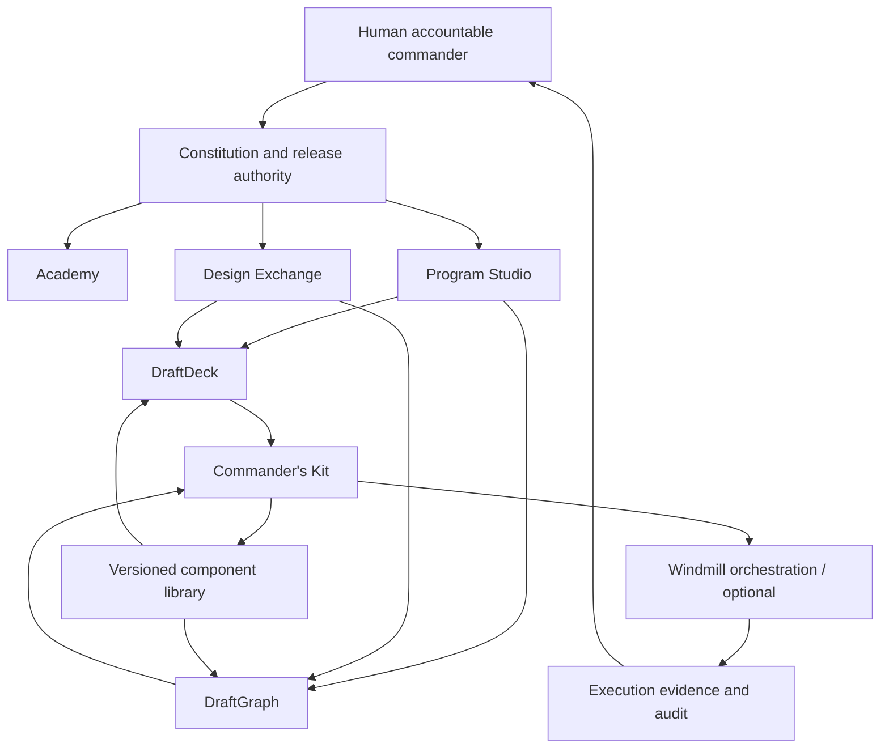
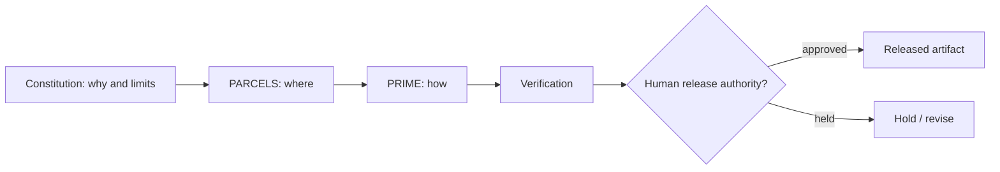
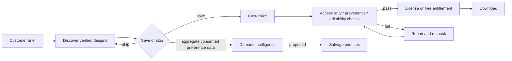
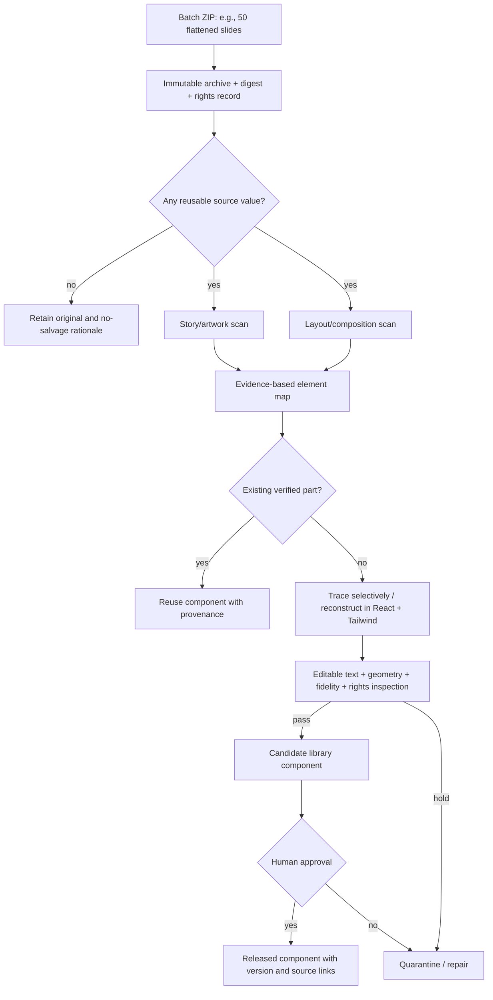
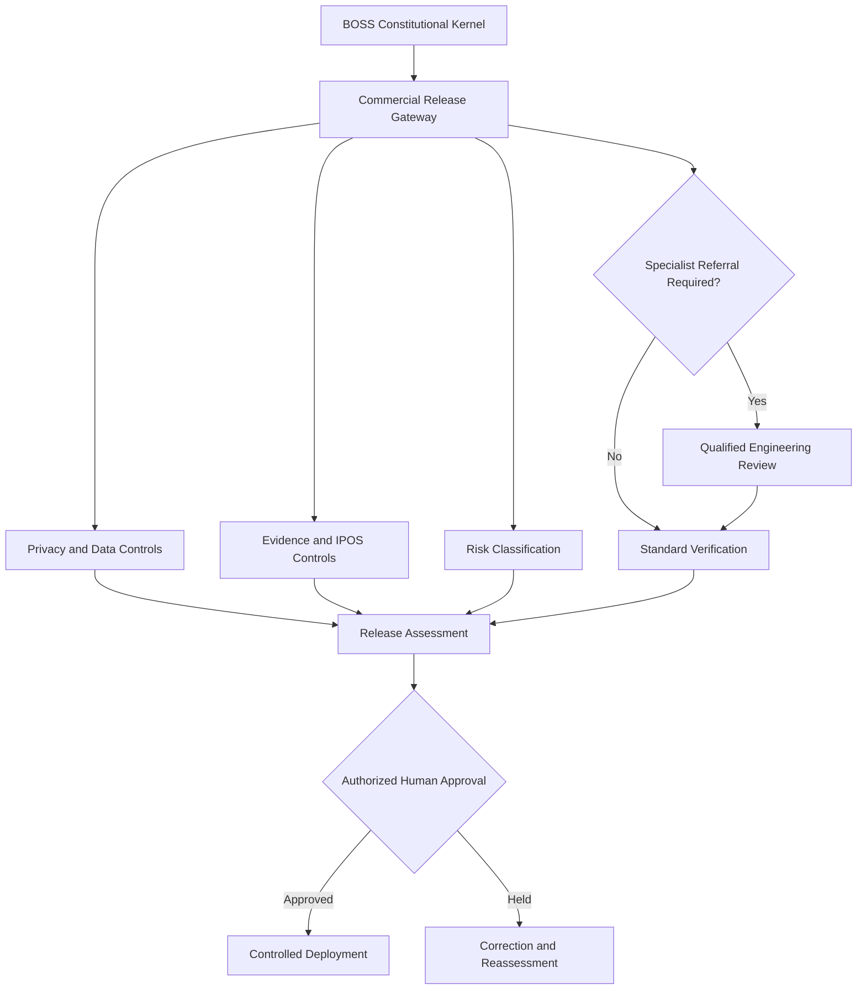
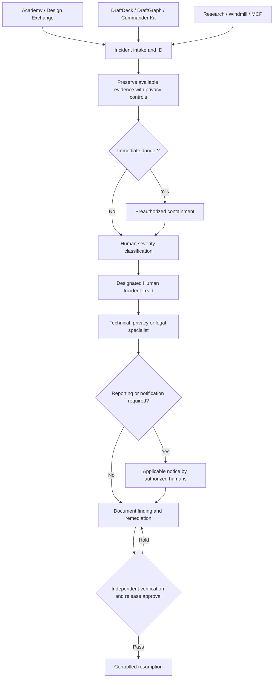
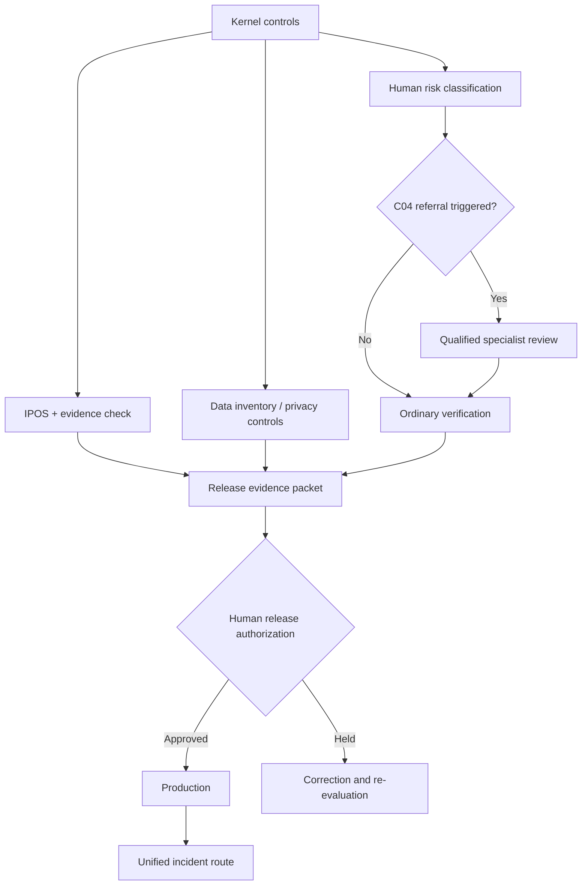

# BOSS — Business Architecture & Commercialization Blueprint
## Draft v3.0 · Standalone successor candidate · 10 October 2026
> **Status: REVIEW DRAFT — NOT RELEASED.** Intended to supersede the earlier business blueprint upon human approval. Earlier version designated **retired for active planning when this successor is approved**; retained permanently as historical source. This draft reconstructs the business architecture from reviewed project decisions and conversation records; **the complete v2.0 original has not been compared line by line**. Gap B01 tracks that reconciliation.
## Executive proposition
BOSS (Bioscillate Operating System by Seven) is a governed program-creation and tool-use framework. Its educational mission is to develop **command judgment**: a learner can select a tool, establish its environment and authority boundaries, inspect outputs, and remain accountable for decisions. BOSS does **not** confer developer status merely because someone can prompt, invoke, or buy software. Developers are separately recognized as the professionals creating and maintaining those underlying systems.
Products: **Academy** (learning), **Program Studio** (program production), **Design Exchange** (discover/customize/download), **DraftDeck** (presentation specialization), **DraftGraph** (infographic specialization; name and build status to verify), **Commander's Kit** (versioned adapters and verified tooling), **Component Library** (originals, salvage, reusable patterns), **Licensing**, **Automation Lab**, and **Research & Verification**. Product scope remains candidate pending ratification.
### Enterprise architecture — proposed, not deployment evidence

## Constitutional division of responsibility
**PARCELS (macro/where):** L1 Platform, L2 Attachment, L3 Routing, L4 Carriage, L5 Exchange, L6 Language, L7 Service. These are canonical conceptual layers; OSI similarity is mnemonic, not literal equivalence. **PRIME (micro/how):** Package → Route → Inspect → Move → Establish Delivery. **Constitution (why/limits):** controls purpose, authorization, evidence, and release. Power is governed flow, not unbounded access.

## Design Exchange — proposed business unit
Experience: submit a need in natural language → browse candidate templates → save/skip/swipe → customize editable text/layout → inspect fidelity → download licensed free or paid output. Swipes are preferences, not consent to train on uploaded private content. Classroom completion and paid purchases are independent.

### Potential monetization — hypotheses, not pricing decisions
Free discovery, limited free licensed templates, individual paid templates, premium generation, subscriptions, and institutional licensing. No customer conversion, margin, CAC, or price point is established. **Research needed:** willingness to pay, customer segmentation, license terms, payment costs, content rights, and accessibility.
## Component salvage and rebuild operations
Original artifacts are immutable archival inputs. A raster slide is scanned in **two separate passes**: (A) story/artwork relationships and (B) composition/element geometry; OCR is an assistive extraction tool requiring review. Vector tracing preserves paths, not semantic text; rebuild textual content as editable text and diagrams as reusable elements where justified. Propose candidate components, deduplicate, validate provenance, inspect editability, and promote only after independent check and approval.

## Tool role registry — provisional
| Role | Example | Actual status |
|---|---|---|
| Tool caller / orchestration | Windmill scripts/flows | Preview tests reported; full production flow unverified |
| Software-analysis specialist | REA | CLI verified in reported Windmill test; real MCP tool call pending |
| Raster preparation | ImageMagick / OpenCV | Candidate, adapter not verified |
| Color vector tracing | VTracer | Candidate, adapter not verified |
| Monochrome tracing | Potrace | Candidate, adapter not verified |
| Segmentation | SAM 2 | Candidate, provider/runtime not verified |
| Text recognition | Tesseract | Candidate, accuracy not assessed |
| Vector rendering | resvg | Candidate, rendering QA not assessed |
| Design delivery | Canva adapter | Historical route verified; current flagship re-verification pending |
**MCP/API policy:** A command-line utility is not automatically an MCP server or HTTP API. Wrap only after testing a bounded adapter. Source repository registration ≠ live invocation.
## Data model and governance
Catalog fields: artifact_id, source_id, archive_digest, license/permission, detection method, story_tags, geometry, reconstruction_version, component_id, reuse_count, candidate_status, inspection_evidence, reviewer, approval, release_version. Store raw user submissions separately; require consent and deletion/retention procedures. User-rating research must not quietly become uncompensated required student labor; participation should be transparent and optional, with meaningful educational benefit and consent.
## Human chain and two-chamber governance — candidate metaphor
The **Human Chamber** evaluates learner rights, accessibility, commercial fairness, and responsible command. The **Systems Chamber** examines skills, code, interfaces, evidence and compatibility. They are *review functions* under one constitution, not AI citizens or democratic legislature. Both advise; final release remains with authorized humans. Developers remain a distinct professional role, not an automatically earned learner rank. Commander qualification should be based on demonstrated tool judgment, not volume of generated code.
## Release milestones
M0 — source archive/rights register; M1 — 50-slide intake and baseline; M2 — reproducible two-pass extraction; M3 — verified component catalog; M4 — editable DraftDeck/DraftGraph builds; M5 — swipeable discovery pilot; M6 — pricing/consent pilot. Each milestone requires evidence and assigned human authorization.
## Active gap register
| ID | Unknown / approval required | Resolution evidence |
|---|---|---|
| B01 | Complete v2.0 original not reconciled | Retrieve and compare full text before retiring it officially |
| B02 | Component library repository not yet verified as created | GitHub repo ID/commit and governance files |
| B03 | DraftGraph name, implementation and ownership | Source repository/skill inventory |
| B04 | Raster-to-editable reconstruction quality | Blind evaluation on 50-slide sample; text and visual metrics |
| B05 | Licensing and upload permissions for NotebookLM-derived slides | Rights assessment and consent records |
| B06 | Swipe UI and paid entitlements | Implemented and tested UX + terms |
| B07 | MCP wrappers for visual tools | Installed adapters, schemas, actual tool calls |
| B08 | Windmill deployment and durable evidence database | Production runs, migrations, review |
| B09 | Governance chamber memberships, voting/approval authority | Ratified constitution and operational role matrix |
| B10 | Economic feasibility, actual demand, privacy controls | Pilot data and reviewed commercial policies |
## Change control
This is an inclusive strategic draft, not proof of deployed features. Archive prior versions permanently; no retroactive alteration. Adopt by explicit human ratification with date and source commits. All diagrams are editable Mermaid source.
---
# Constitutional Amendment Pass — v3.1 Candidate
Status: CANDIDATE — NOT RATIFIED AS OPERATING IMPLEMENTATION
Source: User-supplied v3.1 surgical amendment proposal, 10 October 2026.
Integration rule: Preserve all v3.0 business sections; this amendment introduces controls to be reconciled into their owning sections before release. The Texas-informed charter remains a candidate internal standard, not a legal-compliance certification.
## 1. Change Register (v3.0 to v3.1)
| Modification | Constitutional Origin | Description |
|---|---|---|
| Added | Article X | Kernel Supremacy: Commercial systems must demonstrate compliance with inherited kernel controls prior to release. |
| Added | Article C04 | Mandatory Specialist Referral: Formal gateway and qualified engineering sign-off for high-risk implementations. |
| Refined | Article C07 | Separate operational telemetry from human-participant research; require applicable ethical oversight before efficacy claims. |
| Refined | Article C10 | Categorized retention, security requirements, and individual data-rights procedures. |
| Added | Cross-Article | Constitutional Compliance Matrix for machine-assisted checks and accountable human verification. |
## 2. Enterprise Architecture: Commercial Release Gateway
All commercial units (Academy, Design Exchange, DraftDeck, DraftGraph, and other BOSS-governed services) inherit the mandatory operational constraints of the BOSS Constitutional Kernel. No commercial unit may waive IPOS traceability, evidence logging, or privacy controls to accelerate time-to-market. Release is gated by demonstrated compliance and authorized human review.

## 3. Mandatory Specialist Referral — C04
A BOSS practitioner may architect, orchestrate, and diagnose subordinate systems within authorized scope. Where construction triggers material risks—including custom cryptographic implementation, scaled production infrastructure, privileged security controls, regulated processing, or other specialized engineering—the standard orchestration workflow shall hold pending documented referral to a qualified specialist.
The handoff record shall identify the trigger, receiving specialist, scope, risk, acceptance criteria, review evidence, and human sign-off. AI-generated code alone does not prove engineering competence. Specialist competence shall be evaluated against the task, not by title alone. A non-production sandbox may reduce exposure but is not an automatic waiver for dangerous work.
## 4. Data Model, Privacy, and Retention — C10
Privacy is an inherited control with documented purpose, data classification, retention, access, and deletion policies; it is not a declaration that every kind of data has the same TTL.
- Raw uploads and unverified inputs: short, justified, automated TTL where feasible, with specific exceptions for user requests and lawful retention.
- Operational telemetry: retention based on debugging, security, and audit purpose; minimize PII in logs, prompts, filenames, screenshots, and error traces.
- Financial and compliance records: follow applicable legal, contractual, and audit periods.
- Approved research and security evidence: data minimization, separation of identifiers, role-based access, documented retention and legal holds as applicable; do not assert that all data can be fully anonymized.
- Individual rights: mechanisms to receive, authenticate, evaluate, and respond to access, correction, deletion, and other legally applicable requests; record completion or permitted refusal.
End-user uploads to Design Exchange are NOT automatically licensed for public component-library reuse, model training, or publication. Separate documented permission or another applicable lawful basis is required.
## 5. Research and Verification — C07
Execution logs, tool invocations, latency, defect counts, and API response data are operational telemetry. They can support debugging and performance measurements to the limits of the evidence.
Claims about learner achievement, behavioral change, or educational efficacy shall require a distinct research protocol, appropriate participant protections, and applicable independent ethics review. Operational records may be included in approved research where processing is authorized, minimized, and disclosed; the prohibition concerns unauthorized secondary use, not every use of technical data in research.
## 6. Constitutional Compliance Matrix — Candidate Implementation Instrument
| Control | Article | Responsible Owner | Required Evidence | Verification | Exception | Status |
|---|---|---|---|---|---|---|
| Kernel inheritance | X | System architect | IPOS mapping, controls inventory | Static checks + human review | No silent waiver | DESIGN REQUIRED |
| Specialist referral | C04 | Commander / engineering lead | Scoped handoff and acceptance sign-off | Competency and work-product review | Assessed by risk, not sandbox label | DESIGN REQUIRED |
| Research separation | C07 | Research lead | Purpose, protocol, participant protections | Protocol and data-use audit | Approved, authorized secondary use only | DESIGN REQUIRED |
| Data retention | C10 | Data custodian | Classification schedule, TTL/deletion verification | Inspect configuration and deletion evidence | Applicable preservation holds | DESIGN REQUIRED |
| Risk classification | C11 | Authorized human | Risk assessment and approval | Independent review as appropriate | No blanket template exemption | DESIGN REQUIRED |
**Interpretive note:** “DESIGN REQUIRED” records a prescribed future control, not evidence that the control has been deployed or tested. Automated static checks cannot alone prove privacy compliance.
## 7. Pending Reconciliation and Gaps
- V31-01: Update existing v3.0 enterprise diagram and sections to incorporate this amendment without duplicating or contradicting it.
- V31-02: Approve risk triggers, responsible specialist qualifications, and release acceptance evidence.
- V31-03: Inventory actual Academy and Design Exchange data and establish purpose-specific retention schedules.
- V31-04: Implement and test rights-request workflow, authentication, deletion, backups, and legal-hold handling.
- V31-05: Define research protocols and determine when external institutional ethics review is required.
- V31-06: Implement executable compliance tests and collect results for each proposed commercial unit.
- V31-07: Reconcile the complete prior v2.0 business blueprint before declaring this successor comprehensive.
- V31-08: Ratify control owners and constitutional versions; no release approval is asserted.
End of v3.1 candidate amendment.
---
# v3.2 CANDIDATE — CROSS-DOCUMENT SYNCHRONIZATION AMENDMENT
Date: 10 October 2026. Status: REVIEW DRAFT. Existing v3.0 business blueprint and v3.1 amendment are preserved above; this section proposes integration and supersedes conflicting candidate instructions only when human-approved.
## 1. Constitutional Control Register for Commercial Operations
| Control ID | Provision | Scope | Owner (role; person TBD) | Required evidence | Release gate |
|---|---|---|---|---|---|
| BOSS-X-01 | Article X | All commercial units | Human release authority | IPOS map, evidence check, inherited privacy controls | HOLD if missing |
| BOSS-C04-01 | C04 | Security/engineering-sensitive work | Commander + qualified specialist | Signed referral and acceptance record | HOLD pending clearance |
| BOSS-C07-01 | C07 | Academy analytics, efficacy claims | Research lead | Purpose-separate records and approved participant protocol as applicable | HOLD human research claim |
| BOSS-C10-01 | C10 | All personal data workflows | Data custodian | Inventory, rights process, retention and deletion tests | HOLD deployment if required controls missing |
| BOSS-C10-06 | C10.06 | Commercial and research anomalies | Designated human incident lead | Routing, incident ID, notification escalation, verified closure | HOLD restoration |
| BOSS-C11-01 | C11 | All production work | Authorized human + reviewer | Risk tier and appropriate impact assessment | HOLD until approved |
## 2. Commercial / Research Incident Routing
A common incident intake and numbered register shall serve all BOSS production and research functions. Prior to any production launch the responsible authority shall name incident lead, alternates, technical responder, data custodian and legal/privacy contacts appropriate to scope. Windmill may create alerts and evidence records but shall not independently adjudicate breach-notification law or authorize restoration.

## 3. Mandatory Specialist Referral Gateway
Requests involving custom cryptographic adapters, privileged security, sensitive processing, complex infrastructure or other work beyond approved competence enter a HOLD state and a scoped Architect-to-Engineer handoff. The handoff identifies requirement, qualified reviewer, deliverable, security assumptions, tests, acceptance criteria and responsible human release authority. Non-production sandbox status alone does not waive high-risk controls. Standard component configuration and safe scripting may proceed within approved capability boundaries.
## 4. Privacy and Commercial Rights
Academy and Design Exchange user uploads shall never be automatically treated as permission to publish, commercialize or train on submitted material. Data classes require individually approved TTLs or retention schedules, deletion validation, rights-request UI/processes, backup disposition and documented legal holds. Consent to user experience telemetry does not constitute consent to human-outcome research. Research reuse of operational data requires appropriate authority and protections.
## 5. Commercial Risk Assessment
Each proposed release shall document an initial tier (T1–T4 as candidate nomenclature), uncertainty, rights/sensitivity, external-state effects, rollback strategy and applicability of impact or data-protection assessments. Material changes repeat the affected assessment.
## 6. Unified Release Gateway

## 7. Business Gap Register v3.2
| ID | Unclosed work | Closure test |
|---|---|---|
| B32-01 | Named incident command and escalation missing | Assign lead and backup; exercise an incident drill |
| B32-02 | Specialist handoff not operational | Run reviewed simulated handoff |
| B32-03 | Data catalog, TTLs, user rights and backup behavior undefined | Approved schedule and deletion/rights test |
| B32-04 | Control matrix currently textual | Machine-readable specification + negative tests |
| B32-05 | Risk tiers not yet applied to all products | Human-approved per-product assessments |
| B32-06 | Constitutional v1.0 candidate not ratified | Document ratification and version reference |
| B32-07 | Earlier v2.0 blueprint not line-by-line reconciled | Provenance and missing-business-section review |
No controls were deployed merely by adding this text.