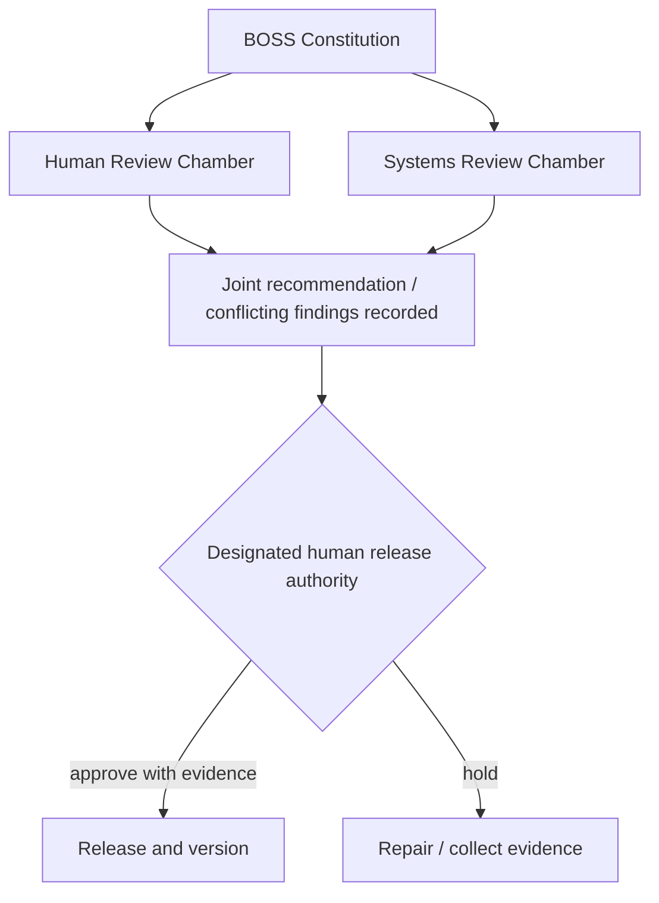
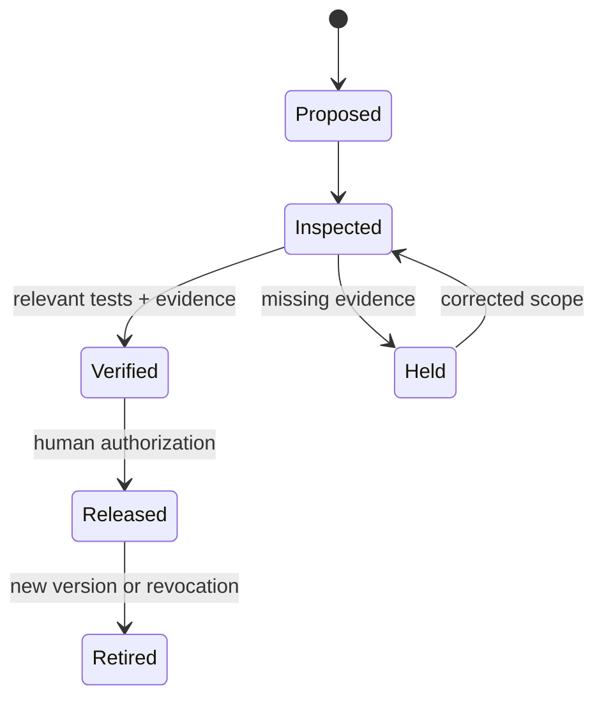
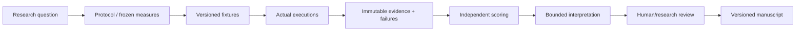

# BOSS Constitution of Command, Skills, Research and Release
## Proposed Founding Charter v0.1 · 10 October 2026

> **DRAFT FOR RATIFICATION.** A project-governance instrument expressed in statutory form; not a claim of public-law force, legal incorporation, democratic representation, or constitutional status under any nation. Nothing here replaces applicable law, contracts, privacy duties, institutional research review, or licenses.

### Preamble
We establish a human-accountable system for the creation, movement, inspection, teaching, and release of work accomplished with computational agents. Authority shall not arise from confidence, verbosity, model identity, possession of a key, a tool connection, or a successful build. All acts shall remain bounded by purpose, evidence, consent, and accountable human release.

## Article I — Supremacy and scope
**§1.** This Constitution states BOSS-wide constraints. Derivative constitutions for skills, research projects, and products may strengthen, but shall not weaken, those constraints.
**§2.** The structural formula is **Constitution = why/limits; PARCELS = where; PRIME = how**. The seven layers of PARCELS are Platform, Attachment, Routing, Carriage, Exchange, Language and Service. PRIME means Package, Route, Inspect, Move, Establish Delivery.
**§3.** These systems are pedagogical and organizational analogies. Humans are not CPUs; AI models are not political subjects; layers are not literal OSI networking functions.

## Article II — Human command and professional boundaries
**§1.** Every released artifact must have a named accountable human or institution with actual delegated authority.
**§2.** The Academy may define learner progression from novice to qualified Commander only by demonstrable capability in selecting tools, setting limits, interpreting evidence and governing release.
**§3.** Tool fluency confers neither software-engineering credentials nor authority to make clinical, legal, financial or high-impact judgments beyond competence.
**§4.** Developers, security practitioners, artists and subject experts retain professional authorship and attribution; the Commander coordinates rather than appropriates their expertise.

## Article III — Two chambers of review
**§1. Human Review Chamber:** learner welfare, consent, accessibility, fairness, licensing, educational assessment, commercial representations and mission alignment.
**§2. Systems Review Chamber:** tool readiness, code, interface schema, dependencies, reproducibility, provenance, performance, security and verification sufficiency.
**§3.** A review chamber may be implemented as a documented review function; no claim of electoral representation is implied. Learners may submit feedback directly; voting or delegated representation is not established until separate rules are ratified.
**§4.** Neither chamber alone gains release authority merely by approving a review. A properly designated human release authority accepts, rejects or holds the resulting recommendation.



## Article IV — Constitutional rights and duties of participants
**§1.** Learners are entitled to intelligible learning goals, accessible baseline routes, honest capability disclosures, meaningful assessment feedback and notice of uses of submitted work.
**§2.** Learners may decline optional data contribution or marketplace activity without automatic loss of educational credit.
**§3.** Humans shall receive credit for attributable creative or development contributions under applicable agreements.
**§4.** Human privacy, licenses, safety and retention obligations supersede experimentation convenience.

## Article V — Skills as governed instruments
**§1.** Each skill shall possess a **Skill Constitution** recording scope, exclusions, required inputs, permitted tools, authorization boundaries, environment checks, evidence contract, fallback behavior, tests, failure states, external dependencies, versions, approvers and amendment procedure.
**§2.** Skills shall not silently install software, access secrets, publish content or grant themselves permissions outside an approved execution envelope.
**§3.** Each substantive capability must pass readiness stages: Environment → Dependency → Registration → Discovery → Invocation → Evidence verification.
**§4.** A tool configuration is not evidence of connection. Tool connection is not evidence of invocation. Invocation is not evidence of task correctness.



## Article VI — Data, source, provenance and verification
**§1.** Originals shall be preserved unchanged, with digest, origin, version and rights status; derived outputs shall retain source linkages.
**§2.** Missing facts must be marked UNKNOWN or NOT ESTABLISHED, not filled by plausible invention.
**§3.** Evidence of transfer, receipt, format compliance, destination fidelity, approval and release shall be recorded as separate claims.
**§4.** Reproducible tests, negative controls, independent review and appropriate denominators should be used where warranted.

## Article VII — Research Integrity Constitution
**§1. Intention.** Research shall evaluate specified claims rather than promote BOSS through untested success statements.
**§2. Construction.** Every academic document shall distinguish theoretical model, system implementation, demonstration, pilot, and comparative study.
**§3. Pre-specification.** Research questions, outcomes, eligible populations, denominators, fixtures, randomization, settings, exclusions, and review procedures shall be fixed before any confirmatory analysis.
**§4. Provenance.** Retain raw prompts, sources, run IDs, tool versions, provider/model identifiers, complete errors and evidence digests where permitted. Raw evidence shall not be overwritten by interpretation.
**§5. Fair comparisons.** Compare models against the same frozen evidence packet, report exposure/settings differences, distinguish execution quality from a model's judgment, and separate human learner assessment from tool success.
**§6. Claim discipline.** No speculative sample size, statistical significance, novelty, efficacy, superior performance or verified editability shall be published as an observed result.
**§7. Review.** Require source check, diagram review, bibliographic audit, relevant ethics/rights review, and recorded human approval before research release.
**§8. Corrections.** Revisions shall append or version corrections; never erase contradictory runs.

### Academic document construction control


## Article VIII — Visual representation and diagrams
**§1.** Mermaid and PlantUML are permitted as editable semantic source. A rendered diagram is supplementary, not a replacement for its source.
**§2.** Each figure must carry a figure number, title, descriptive caption, version and status (Observed / Proposed / Illustration).
**§3.** Diagrams may not imply deployment, causality, authorization, or efficacy where unverified.
**§4.** BOSS identity shall use approved branding; visual polish does not supersede evidence or accessibility.

## Article IX — Releases, amendments, and retirement
**§1.** Each proposal records scope, source references, change radius, reviewer, decision and effective version.
**§2.** Amendments require review through both functions where relevant, human approval, and versioned release; unapproved drafts remain drafts.
**§3.** Retirement means displaced from active use, **not deletion**. Original records remain accessible under applicable retention policy.
**§4.** Emergency holds may prevent harm; they shall be documented and reviewed afterwards.

## Schedule A — Skill constitution template
```yaml
skill_id: CANDIDATE
purpose: UNKNOWN
owner: UNASSIGNED
parcels_primary_layer: UNKNOWN
prime_stages: []
inputs_and_source_rights: []
permitted_tools: []
forbidden_operations: []
capability_preflight: []
response_and_evidence_schema: UNKNOWN
fallback_path: UNKNOWN
verification_profile: UNKNOWN
release_authority: UNASSIGNED
amendment_review: UNASSIGNED
```

## Constitutional gap register
| ID | Unsettled matter | Required ratification |
|---|---|---|
| C01 | Who appoints human reviewers, terms, conflicts of interest | Governance role charter |
| C02 | Learner direct participation or representative system | Consultation and rights policy |
| C03 | Human Commander qualification and appeal | Academy credential standard |
| C04 | Distinct professional developer relationship | Authorship/credit and contracting policy |
| C05 | Data consent, deletion, private source material and IP | Privacy and licensing controls |
| C06 | Which skills require higher-risk safety review | Risk-tier matrix |
| C07 | Actual research ethics oversight and institutional status | Named reviewer/institution; avoid claiming IRB approval |
| C08 | Final ratifier and formal effective date | Signed approval record |

**Ratification block:** Proposed by: BOSS project team / Human ratifier: __________ / Date: __________ / Accepted version: __________ / Dissent or reservations: __________.