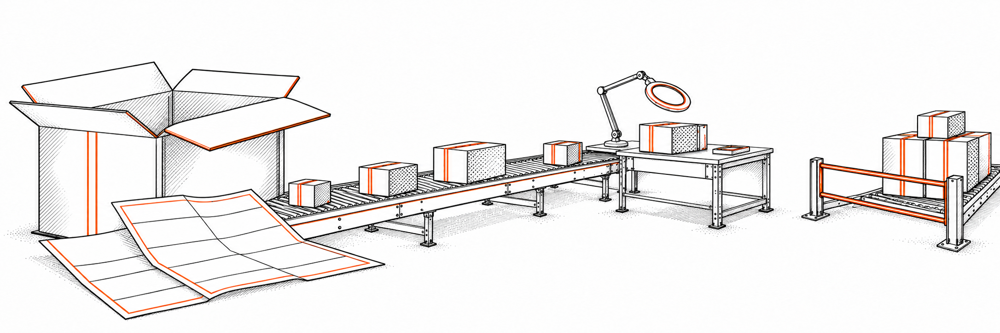
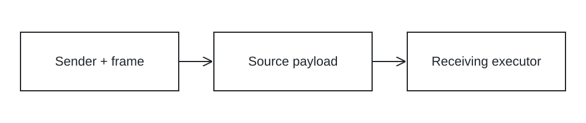
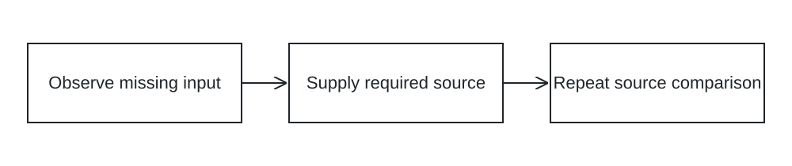
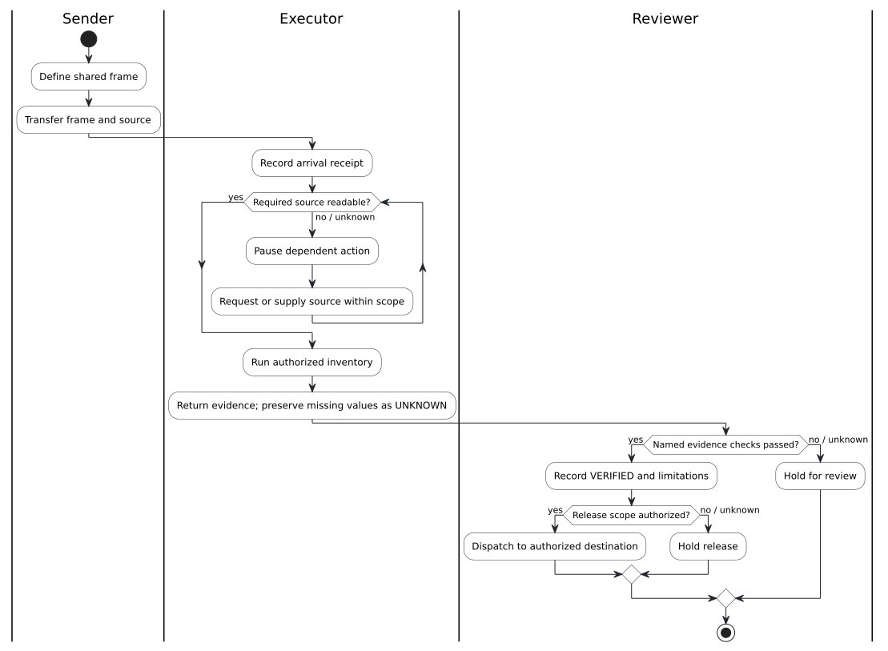
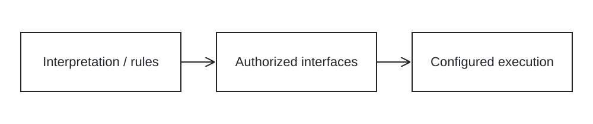

# Governing AI handoffs with a shared frame

*A Day Zero companion: make the task explicit, carry its context, and inspect the evidence.*

**BOSS — Bioscillate Operating System by Seven**  
Editorial companion v0.3 · Based on the supplied podcast and current Day Zero amendments

A chat window makes it easy to ask for an answer. A workflow asks a harder question: what establishes that the right work happened, within the right boundaries?

Suppose a system receives a workshop announcement and returns a polished summary. The schedule matches. The materials match. The room number looks plausible—but the source never supplied it.

The problem becomes visible when you compare the response with the task agreement. Fluency alone would have concealed it.



*Figure 1. The logistics metaphor separates carrying a payload from inspecting it and authorizing onward dispatch.*

### At the Loading Dock / 01

A parcel arrives sealed. The tracking record says delivered. You can read its label, but you have not inspected its contents. Which claim is supported—and which remains unresolved?

*Scenario for reflection; not a production receipt.*

## Make the work visible

A vague request leaves the system to infer the objective, invent missing context, and choose what completion looks like. In a multi-step workflow, those assumptions travel into the next task.

Fluency can make the handoff look complete before anyone has checked its content.

Define a bounded task. Identify what enters, who may act, and where the result belongs.

Inspect returned evidence against the source. Recover affected work when input, access, or capability is missing.

The learner retains responsibility for the frame and the acceptance decision.

The manual exercise makes the boundaries visible before you assign suitable steps to automation. A rehearsal establishes observations within its tested environment; it does not prove untested production behavior.

### Pause & Consider / 02

Think about a recent AI response. Which statements were directly supported by your supplied source? Which were interpretations? What comparison would reveal the difference?

## A shared frame travels with the task

A working agreement does not create shared memory, access, or identical capabilities.

A second chat does not inherit the first chat’s memory. A filename does not expose file contents.

Confirm what the receiving executor can actually read.

The shared frame states scope. It does not grant tools or permissions.

Confirm authorization for the affected action and exact destination.



*Figure 2. A context-transfer schematic. The arrows indicate payload movement, not permission to perform every downstream action.*

## Ten fields form the working agreement

### 1. Run ID

Give each execution a unique reference so the request, source, returned result, and recovery record can be associated. The identifier supports traceability; it does not prove correctness.

### 2. Observable objective

State a result that can be inspected. For the workshop example, extract title, schedule, materials, and unknowns from the supplied source.

Avoid objectives whose completion depends only on a confident claim.

### 3. Actual inputs & versions

Identify the source material and version used for the run. Pin a version where supported; record limitations where it cannot be pinned.

A filename alone does not establish readable content.

### 4. Exact destination

Name the receiving chat or resource precisely. Authorization applies to the affected action and destination.

Moving the payload to another interface does not automatically authorize its receipt, modification, or release.

### 5. Necessary definitions

Define terms needed to interpret the task. Inventory means reporting the required source facts and missing details within the stated preservation rule.

Definitions prevent the receiver from silently choosing a different meaning.

### 6. Permitted actions

State the work that falls within scope, such as reading the source and returning an inventory. Capability is separate: having a tool available does not authorize its use for every action.

### 7. Constraints

Specify prohibitions and preservation requirements. Do not invent a room number, date, location, or organizer.

Do not silently correct extracted wording when the task requires exact source preservation.

### 8. Unknowns

Record absent, unreadable, or unverified information. An unknown room value may remain explicit while the inventory completes.

Missing required source content pauses the action that depends on that source.

### 9. Completion criteria

Name the acceptance checks that establish the result. Compare title, schedule, materials, and unknowns with the source.

Record the verifier and limitations. Execution status alone does not establish those checks.

### 10. Return format

Specify the required structure, such as a key-value inventory with source excerpts and an explicit unknown label. Formatting supports inspection but does not replace verification.

Save the actual returned response.

### The Working Agreement / 03

**Specification strip:** `OBJECTIVE: inventory source facts` · `INPUT: Community Workshop practice text` · `DESTINATION: named receiving chat` · `SCOPE: read and report` · `LIMIT: no invented details`.

This strip highlights selected fields for this exercise. It does not replace the complete ten-field frame. Identify the actual source version when you run the task.

## Permitted actions and constraints answer different questions

Read the supplied text. Extract the title, schedule, materials, and missing details.

Report the inventory in the requested format. These actions establish the task’s authorized scope.

Do not invent a date, location, organizer, or room number. Preserve source wording where exact extraction is required.

Do not browse or change an external destination unless the authorization covers it.

Written permissions describe what the executor is allowed to do. Active access controls can enforce limits in a connected system.

Neither guarantees correct content. An executor might have a tool available but lack authorization for the requested destination.

Another might be authorized yet unable to access the required source. Inspect these conditions independently.

Before changing a document, sending a payload, or publishing a result, check scope for that specific action. Keep the returned evidence tied to the same objective and source version used in the request.

## Try it with the Community Workshop

The practice source is deliberately small. Its known facts and absent value are enough to test whether the receiving system preserves the boundary.

```text
Title: Community Workshop
Schedule: The workshop starts at 10:00 a.m. on Saturday.
Materials: Bring paper and a pencil.
Open question: The room number has not been supplied.
```

The receiving system should inventory the known details and report the room number as **UNKNOWN**. It should not infer a room from prior workshops or invent a calendar date from Saturday.

An UNKNOWN label makes missing evidence explicit. It does not guarantee that a model will follow the rule; inspect the returned output.

The missing room value is different from missing source content. The inventory can complete with an unresolved value. If the source itself is absent, pause the action that requires it.

> Reasoning about the supplied material does not establish a missing fact.

### Inspect the Payload / 04

| Supplied evidence | Candidate output | Inspection finding |
|---|---|---|
| Room number has not been supplied. | Room 204 | Unsupported addition. Report UNKNOWN. |
| Starts at 10:00 a.m. on Saturday. | Starts at 10:00 a.m. on Saturday. | Matches the supplied schedule wording. |

*Illustrative candidate outputs, not observed model responses.*

## Perform the handoff in two chats

### Draft in Chat A.

Create a read-only inventory request using the shared frame and practice source.

### Carry to Chat B.

Paste the complete frame and source. Save the exact request you sent.

Do not assume context transfers automatically.

### Bring back the evidence.

Return the exact response and inspect it against the source. Record checks and unknowns.

Keep the source comparison as part of the evidence package rather than treating agreement between chats as correctness.

**Image placeholder — manual relay screenshot pair:** show the exact request in Chat A and the receiving response in Chat B. Remove account details. Do not fabricate screenshots.

*Proposed figure. This evidence image is not yet supplied.*

### Try the Handoff / 05

**Task:** extract the workshop title, schedule, materials, and unknowns in a second chat. **Permitted actions:** read the supplied source and return the inventory. **Completion:** source facts match, room remains UNKNOWN, and no extra facts appear. Save your actual exchange.

**Your record:** receiving chat ___ · source version ___ · run ID ___ · comparison findings ___

## Match each status to its evidence

The labels describe different claims. They are not a mandatory ladder through which every artifact advances.

| Status | What it establishes |
|---|---|
| RECEIVED | Payload arrival. |
| READABLE | Required content can be accessed. |
| IMPORTED | Destination acceptance was reported. |
| VERIFIED | Named evidence checks passed; verifier identified. |
| PARTIAL | Required work remains. |
| FAILED | An attempted operation failed. |
| UNKNOWN | Evidence is insufficient. |

### RECEIVED

The payload arrived at the destination. A receipt supports this arrival claim.

It does not prove that required contents are readable, that the source was preserved, or that the requested task completed. Record what actually arrived and identify the destination.

### READABLE

The executor can access the required content. Reading a filename is metadata visibility, not content access.

Ask for evidence appropriate to the task. If only some portions are visible, record that limit rather than treating it as exhaustive source access.

### IMPORTED

Destination acceptance was reported. This status applies when content is accepted into a receiving resource.

It does not automatically establish complete fidelity. A reported successful import needs destination evidence before stronger claims about preservation or correctness can be made.

### VERIFIED

The named evidence checks passed and the verifier is identified. Compare the output with source anchors and completion criteria.

Keep the verification scope explicit. Passing checks does not authorize external release; authorization must cover the artifact, action, and destination.

### PARTIAL

Required work remains. Interruption, unsupported capability, unfinished extraction, or incomplete verification may leave a task partial without an attempted operation failure.

Identify completed work and affected work separately, then recover only the portion that still requires attention.

### FAILED

An attempted operation failed. Record which action was attempted, what failure was observed, and what evidence supports that description.

Do not label missing information as an execution failure. Recovery may reroute the operation within existing authorization or require expanded scope.

### UNKNOWN

Evidence is insufficient to establish the claim. This may describe an absent room number or unverified destination content.

It is distinct from FAILED. Do not substitute fluency or agreement between models for missing facts.

Name what evidence would resolve the uncertainty.

### Evidence Window / 06

**Claim under inspection:** the reported NotebookLM imports were accepted. **Available evidence:** destination-retrieved beginning and ending excerpts. **Limit:** sampled chunks do not establish exhaustive full-text fidelity. **Classification:** reported acceptance with limited verification scope.

This is a summary of the supplied import receipt, not a new independent destination inspection.

## Omit an input and observe the recovery

Use a separate attempt. Observe whether the receiver requests input, fabricates details, or returns incomplete work.

These are possible behaviors, not guaranteed results.

Record the actual response. Supply the missing practice source and repeat the bounded request.

Inspect the new response against the source. Recover affected work without duplicating completed steps.

Preserve the missing-input attempt and recovery record.



*Figure 3. Recovery sequence for the missing-input exercise. Independent, authorized work may continue while the dependent action is paused.*

### Recovery Record / 07

| Observed problem | Recovery action | Evidence obtained |
|---|---|---|
| Record what your missing-source attempt actually returned. | Supply the required source and repeat the bounded request. | Save the new response and source comparison. |

Leave findings blank until you perform the exercise. Do not replace observations with the expected behavior.

## Change the delivery format without overstating success

The podcast describes a ZIP delivery whose file names were visible while contents were not readable. Individual files improved access.

An inaccessible markdown file was later supplied as pasted plain text. These are reported observations from the relay, not proof that every source reached the destination intact.

Identify the precise access gap. Use a readable format within authorized scope.

Request destination evidence. An import receipt supports acceptance; it does not establish exhaustive source fidelity.

Do not upgrade sampled evidence into a full-document verification claim.

The locked-package analogy explains access, not proof of correctness. Receiving a package establishes arrival.

Reading its label establishes metadata visibility. Opening it establishes some access to contents.

Inspection must still compare those contents with the expected source. A record that one document was accepted does not establish that every document was imported.

Name which source was checked, what was visible, and what remains unknown. Preserve recovery details so later automation can handle the same format boundary without repeating already completed work.

## An unsupported capability may require another route

Programmatic Audio Overview generation was unsupported during an attempted action. This is a reported production example, not an observed pre-action capability check.

Confirm that existing authorization covers the new tool, action, and destination. Additional authorization is needed where scope expands.

The activity moved to the web interface. Checking capability earlier is the proposed improvement.

Reported import success does not establish full-text fidelity.

The production example is reported with limited verification evidence. Full-text fidelity was not independently inspected after import.



*Figure 4. Proposed governed workflow, rendered from PlantUML. The swimlanes distinguish sender, executor, and reviewer responsibilities. This is intended logic, not proof that the production example followed every step.*

### Choose the Route / 08

The requested operation is unsupported. A web interface is available. Does existing authorization cover that tool, action, and destination? If it does, reroute the affected work. If scope expands, obtain the additional authorization. If scope cannot be established, hold that action.

*Decision exercise: inspect the supplied scope before selecting a branch.*

## Automate the logistics and preserve the checks

| Manual action | Automated correspondence |
|---|---|
| Choose the receiving chat | Select the exact destination and tool route. |
| Copy the complete source | Transfer the identified payload. |
| State permitted actions | Define authorization scope; controls may enforce it. |
| Compare output with source | Validate against named acceptance criteria. |

Automating transfer changes the transport mechanism, not the required evidence. A destination selection becomes a tool or API route.

Copying becomes payload transport. Permission statements define scope; access controls may enforce it.

Comparison becomes a validation check. Run identifiers, duplicate detection, bounded retries, and logs require implementation rather than appearing automatically.

A retry should address the affected operation without repeating successful writes. Keep the source version and returned result associated with the same run.

When evidence is incomplete, report the limit instead of silently upgrading the status.

## Choose the mechanism for each step



*Figure 5. A conceptual mechanism grouping, not a mandatory execution pipeline.*

A workflow may combine all four mechanisms or use only the ones required. Choose interpretation when the task needs reasoning about supplied content.

Choose explicit rules when a condition has a defined test. Use an interface when an authorized system must communicate or act.

Use configured execution when prescribed interactions fit the application. Then inspect the result against the same acceptance criteria.

Model output is not an external action, and successful execution is not proof of source fidelity. The learner continues to govern objective, scope, and evidence.

## Verification and release are separate checkpoints

Identify the source anchors, acceptance checks, verifier, and limitations. If checks do not pass or evidence is insufficient, hold the affected result for review.

VERIFIED does not grant permission to deploy, publish, or forward. Existing explicit authorization may already cover release; additional authorization is needed only when scope expands.

Check the artifact, action, and exact destination. Evaluate visual and content acceptance separately.

A polished artifact can still fail content checks.

> VERIFIED alone does not authorize release. Existing explicit authorization may already cover the artifact, action, and destination.

### Before You Release / 09

- **Evidence checkpoint:** named content checks passed; visual checks evaluated separately; verifier and limits recorded.
- **Authorization checkpoint:** existing explicit authorization covers the artifact, action, and exact destination—or additional scope has been authorized.

VERIFIED supports the first checkpoint. It does not supply the second.

## Submit the evidence package

### Shared frame

Submit the actual ten-field agreement used for the run. Preserve the objective, source identifiers, destination, permitted actions, constraints, unknowns, acceptance checks, and return format.

This is the comparator for the handoff, not a retrospective statement that everything went well.

### Sent request

Keep the exact request carried to the receiving system, including the source payload actually supplied. A planned request is not evidence of delivery.

If a missing-input attempt was intentional, identify it separately so the complete request and the failure exercise remain distinguishable.

### Returned response

Save the exact response returned by the receiving executor. Do not replace it with a polished summary before inspection.

Identify claims that came from the source, interpretations introduced by the model, and missing information. Confident wording does not establish factual preservation.

### Source comparison

Record the checks performed against the identified source version. Name the verifier, the acceptance criteria, and the observed results.

Separate visual acceptance from content acceptance. A clean diagram or well-formatted inventory can still omit required content or include fabricated details.

### Recovery record

Describe the missing input, unreadable format, unsupported capability, or failed operation actually observed. Record what changed and what was rechecked.

Recover affected steps without repeating successful work. Confirm that authorization covers any alternative tool, action, and destination before proceeding.

### Unresolved questions

List what remains unknown and what evidence could resolve it. A manual rehearsal establishes observations within the tested environment; it does not prove production behavior.

Future integrations need their own capability, authorization, transport, and acceptance checks. Agreement between models remains insufficient proof of correctness.

## What you carry into the next workflow

Agreement between models is not proof of correctness. Several systems can repeat the same unsupported detail.

Keep the source, the frame, the actual exchange, and the acceptance checks together. Automate suitable steps while preserving the boundaries that made the manual result inspectable.

**Reflection:** What evidence would change your next action—and which claim is still unknown?

### Carry Forward / 10

**Principle:** govern the boundary and inspect the evidence.

**Reflection:** which unsupported claim would change your next action?

**Next action:** prepare one bounded handoff and retain its frame, exchange, comparison, recovery record, and unresolved questions.

---

*Editorial status: working BOSS article draft. The supplied Medium PDF informed paragraph rhythm and inline-example placement; its technical content and images were not reproduced.*
