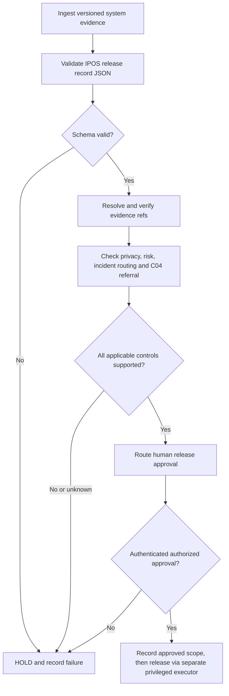

# Commercial Release Gateway — Windmill Candidate Constraints
Status: NOT DEPLOYED. For review against Constitution v1.0 Candidate.

## Proposed Windmill Flow Boundaries
1. **Preflight**: reject missing input version, run ID, source authorization, data purpose, or destination; do not substitute a model answer.
2. **Evidence**: hash and retain available source and tool evidence with proportionate retention and access controls; a missing trace is NOT ESTABLISHED rather than verified.
3. **Schema**: validate against `governance/specs/boss-release-gate.schema.json`; schema validation is not semantic compliance.
4. **Risk**: obtain an authenticated human-assigned tier; require documented impact/DPA review when applicable.
5. **C04**: stop if specialist trigger is indicated and no verified engineering acceptance record exists.
6. **C10.06**: register human incident lead and escalation route; safety alerts may trigger pre-authorized bounded containment.
7. **Human gate**: approval references must be resolved against a controller-held permission record; model-supplied IDs grant no authority.
8. **Execution**: use a separate least-privilege release worker after approval; capture execution and failure receipts; perform post-release inspection.
9. **Negative tests**: missing reviewer, invented evidence, expired consent, unknown risk, malformed record, absent specialist signoff and incident lead must HOLD.

### Explicit unknowns
No Windmill flow, credentials, retention schedules, legal applicability assessment, production authorization or executed validation has been established through this proposed spec.
