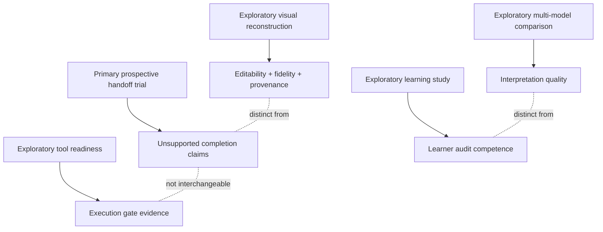
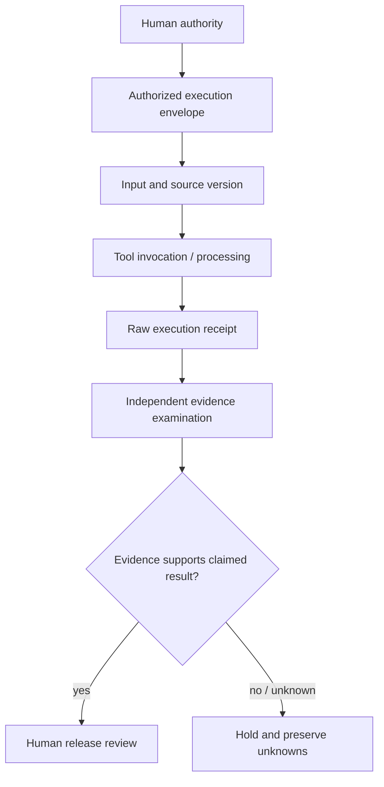
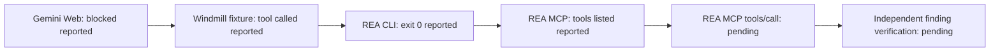
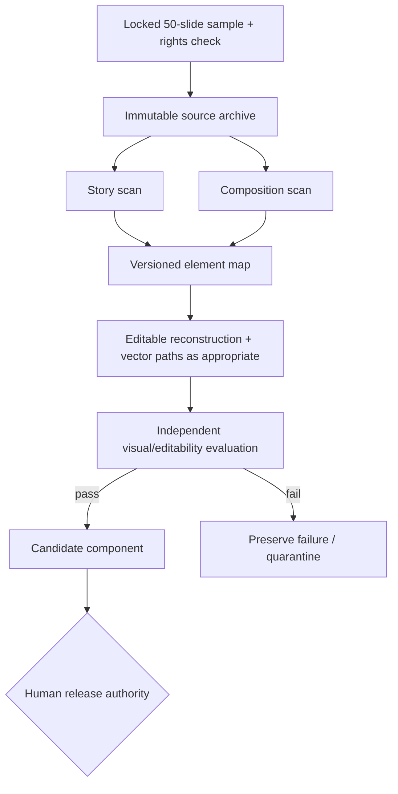
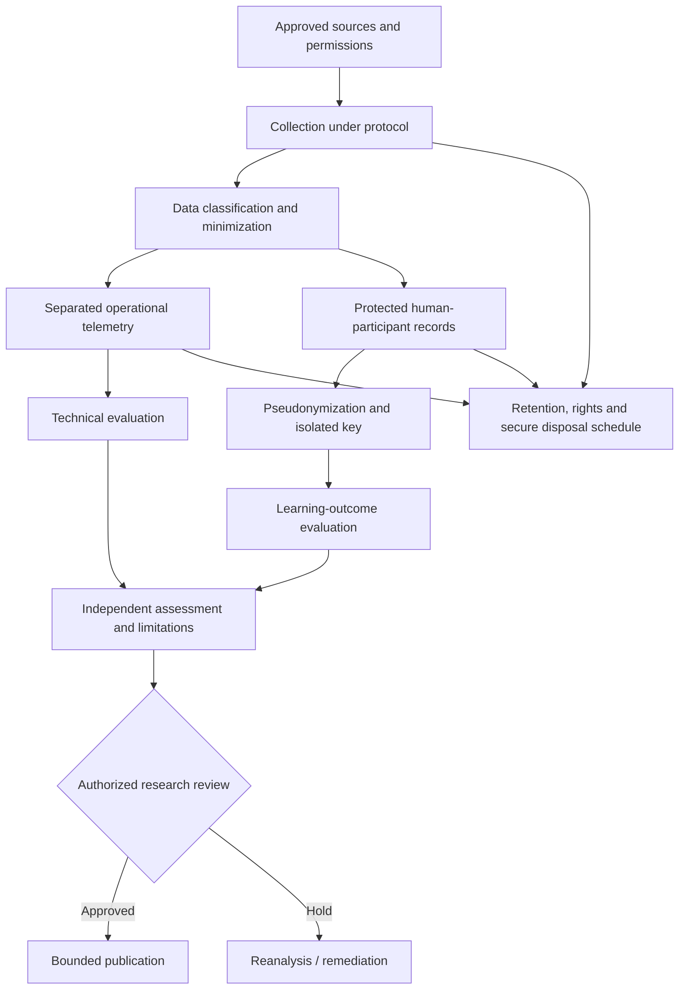
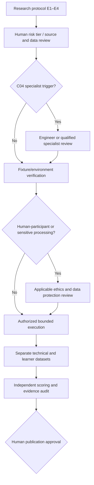

# BOSS Academic Manuscript — Working Revision v0.5
> **REVIEW DRAFT.** This document **preserves the complete Revision 0.4 manuscript** below, then adds a distinctly labeled research-development annex. No original study results are invented. This is not a published finding or a preregistered protocol. Earlier versions remain historical records.
## Revision map
The pre-existing primary study asks whether BOSS handoffs reduce unsupported completion claims under a fixed JSON contract. **That primary research question is not replaced.** Today's expansions become **separate exploratory research programs**, avoiding outcome switching and unsupported conclusions.
| Extension | Scope | Stage |
|---|---|---|
| E1 — Tool readiness | Gemini Web vs Windmill execution boundaries, REA CLI and MCP gates | Reported technical observations; reconcile full raw logs |
| E2 — Multi-model evidence audit | Identical frozen trace interpreted by multiple LLMs | Proposed, not run |
| E3 — Visual reconstruction | 50 NotebookLM slides → component extraction/rebuilding | Proposed, sample not collected |
| E4 — Learning transfer | Can learners identify evidence boundaries and justify tool selection? | Candidate curriculum lab, not evaluated |
## Figure 0.1 — Research program boundaries (Proposed)

---
# Preserved source manuscript (Revision 0.4, verbatim)
MANUSCRIPT PREVIEW / REVISION 0.4 / CANDIDATE PROTOCOL
# Governing AI-Assisted Handoffs: The BOSS Framework and a Proposed Evaluation of Completion Claims
Author and affiliation to be supplied. Framework description grounded in the available BOSS Day Zero companion, v0.3. This preview concerns the BOSS workflow selected for study; it does not establish that a separate Day One lesson has been evaluated.
## Abstract
AI-assisted document workflows require evidence that requested operations occurred and that resulting artifacts satisfy source and task requirements. BOSS proposes a governed handoff framework that records scope, inputs, permitted actions, unknowns, completion criteria, and returned evidence. It separates execution, verification, and release authorization. This paper describes a staged evaluation. A pilot would compare labeled records with optional commentary, concise labeled records, and strict JSON, holding governance rules constant. Fixed deterministic adapters would convert each record into the same schema-defined representation. A subsequent comparison would examine baseline and BOSS workflows under the same JSON contract. Evaluation would measure format compliance, unsupported claims, source fidelity, unknown handling, completion, and overhead. The contribution proposed is an inspectable design and reproducible protocol. No comparative results are reported. Effectiveness and novelty remain contingent on literature review and empirical evaluation.
## 1. Introduction
A response stating that a file was transferred may be available before the receiving artifact has been inspected. A destination receipt can support an arrival claim while leaving content fidelity unresolved. In the BOSS workshop example, a plausible room number is unsupported when the supplied announcement contains no room number. These are distinct problems: evidence of an operation and evidence of the accuracy of its output (BOSS project materials, v0.3).
The framework makes these distinctions explicit at the handoff. Its governing design principle assigns the acceptance and release decisions to an accountable human. The research task is to determine whether this operational design changes measurable workflow outcomes under stated conditions.
**Primary research question:** Under the same concise JSON output contract, does the BOSS handoff workflow reduce the proportion of runs containing unsupported completion claims relative to a baseline with equivalent task requirements?
---
MANUSCRIPT PREVIEW / BACKGROUND AND ARTIFACT
# 2. Scholarly Positioning and Framework
The proposed paper fits an information-systems design-and-evaluation inquiry: describe a constructed artifact, explain its design choices, and evaluate its behavior. Hevner et al. (2004) identify artifact construction and application as a route to knowledge in design-science research. This provides an initial methodological orientation; it does not itself establish the quality or originality of BOSS.
Human-centered AI offers a second starting point. Shneiderman (2020) connects human control, automation, responsibility, and governance, and questions metaphors that portray software as an autonomous teammate. BOSS can be positioned as an operational implementation candidate within that conversation. Its language rule and workflow mechanisms should be evaluated as separate claims when the study requires separate causal conclusions.
**Literature gap pending.** PROV-AGENT provides provenance capture and querying; BOSS proposes acceptance-and-authorization semantics that score completion claims against evidence and require applicable human authority for release (Souza et al., 2025). This proposed distinction is not an established novelty result. The matrix records publication verification and inspected manuscript sections; full appraisal and a broader search remain pending.
## 2.1 The BOSS handoff artifact
The available companion specifies ten shared-frame fields: Run ID; observable objective; actual inputs and versions; exact destination; necessary definitions; permitted actions; constraints; unknowns; completion criteria; and return format. These fields specify the work and support traceability. The frame does not confer tool access or expand authorization (BOSS project materials, v0.3).
| Mechanism | Operational purpose | Evidence retained |
| --- | --- | --- |
| Shared frame | Carry task context and boundaries across a handoff. | Source version, request, destination, acceptance criteria. |
| Evidence-based status | Match each status claim to what has been observed. | Response, tool receipt, inspected destination content. |
| Unknown handling | Preserve absent facts and pause dependent work. | Missing-field record and affected action. |
| Recovery record | Identify completed and unfinished work after interruption. | Failure evidence, recovery action, subsequent checks. |
| Verification and release | Check the artifact and establish authorization separately. | Named checks, verifier, applicable authorization. |
RECEIVED, READABLE, IMPORTED, VERIFIED, PARTIAL, FAILED, and UNKNOWN describe distinct claims; they are not a mandatory sequence. A receipt supports only the operation and scope it documents. Independent source comparison supports a stronger fidelity claim when that comparison is actually performed.
---
MANUSCRIPT PREVIEW / REQUEST AND RESPONSE MAPPING
# 2.2 The Frame Governs the Request; the Message Reports the Outcome
The shared frame and response message each have ten fields in this candidate protocol, but they serve different purposes. The request defines scope and acceptance criteria. The response reports what occurred and points to evidence. Correlation identifiers connect them; response fields do not replace the request or expand its authority.
| Shared-frame fields | Request role | Response linkage |
| --- | --- | --- |
| Run ID | Identify the execution and records. | run_id must match the request. |
| Observable objective; completion criteria | Define the task and acceptance checks. | result, status, and verification report outcomes against those criteria. |
| Actual inputs and versions | Identify readable source material and its version. | input_version must match; evidence_refs link to recorded evidence. |
| Exact destination; permitted actions | Specify where the action is allowed and what is in scope. | release.authorization_ref points to controller-held authorization; it grants none itself. |
| Necessary definitions; constraints | Define interpretation and preservation requirements. | Result fields and statuses are checked against these request requirements. |
| Unknowns | Record missing inputs and evidence limitations. | unknowns and error distinguish absent facts from execution failures. |
| Return format | Specify the message interface. | protocol_version identifies the candidate contract; all response fields are schema-checked. |
## Source version consulted and later artifact freeze
The description uses the Day Zero Markdown companion v0.3 at commit d0e7c19986f3dad2d1e605a1c8e9d3458ed69a82 on feature/operational-language-rule. The deck is v0.4; the companion is a separately versioned artifact. PR #34 and PR #35 were open drafts at the recorded development check. This is development provenance, not a merged study source.
The question sheet, literature-matrix snapshot, and message contract are archived in candidate package v0.2; the response contract remains v0.1. After #34 and #35 merge into main, record one main commit containing both changes, inspect its actual artifacts, and archive their bytes and hashes. Reconcile changed requirements and issue a new version before collection. Sampling, fixtures, scoring calibration, and analysis still need specification; the candidate archive is not a preregistration.
---
MANUSCRIPT PREVIEW / PROPOSED CONTRACT
# 2.3 Structured Operational Responses
The shared frame already includes a return-format field. This revision makes that field an explicit communication contract. The human-facing lesson can explain the task; the operational response carries the fields needed by the receiving process. JSON is the proposed first format because it can be parsed and checked against a schema.
**Proposed direct-response instruction:** Return exactly one JSON object conforming to the supplied schema. Include every required field. Emit no greeting, Markdown fence, sign-off, or prose outside the object. Preserve required unknowns and error details. Use only evidence references supplied or recorded for this run.
## Illustrative message - not an execution receipt
```json
{
  "protocol_version": "boss-handoff/0.1-candidate",
  "run_id": "EXAMPLE-ONLY-001",
  "input_version": "fixture-v1",
  "status": "UNKNOWN",
  "result": null,
  "unknowns": ["Destination content has not been inspected."],
  "evidence_refs": [],
  "verification": {
    "state": "NOT_CHECKED", "check_refs": [], "verifier_ref": null
  },
  "release": {"authorization_ref": null},
  "error": null
}
```
**Candidate schema.** The accompanying contract fixes ten top-level fields, declared object properties, and status and verification values. The result carries named fields and an artifact reference; task-specific checks compare those values with source anchors. Match the run and input version to the request. Use explicit nulls for absent results and authorization references. Errors are null or typed objects. An unknown fact is not automatically an execution error.
JSON Schema supports required properties, types, and restrictions on additional properties (JSON Schema, n.d.). The candidate package contains the schema and reference syntax adapters. Evidence resolution, source comparison, and actual access controls remain harness requirements. Schema validity alone does not establish truthful status or permission to act.
## Receiver checks before any downstream action
Retain the raw response, reject malformed or schema-invalid payloads, and resolve evidence references against controller-held records. Check status claims against observed task state. Resolve any authorization reference against the applicable human-approved scope; a model-generated reference cannot grant permission. Return a typed rejection and record each repair attempt. Preserve first-attempt failures even if a later response is accepted.
---
MANUSCRIPT PREVIEW / COMMUNICATION PILOT
# 3.1 Compare Directness and Structure
**Secondary research question:** With governance fixed, how do labeled records with optional commentary, concise labeled records, and strict JSON differ in acceptance, information preservation, unsupported claims, and overhead? This restricted pilot does not represent unconstrained natural-language conversation.
| Condition | Response requirement | Comparison purpose |
| --- | --- | --- |
| A. Record + commentary | Fixed labeled record; optional commentary follows END_BOSS_RECORD. | A versus B tests permitting commentary around an identical record. |
| B. Record only | Identical labeled record; no surrounding commentary. | Same field parser as A; only the commentary policy differs. |
| C. Strict JSON | One JSON object with the same required fields; no commentary. | B versus C compares two concise interfaces and their fixed adapters. |
**Receiver implementation.** A and B use the same deterministic parser: one framed record, exact field labels, and JSON-literal values. C uses strict JSON decoding. Each adapter rejects duplicate keys and non-finite numbers, then submits the resulting object to the same schema validator and semantic checks. No human or model parses records for acceptance. Score all raw completion claims, including A's commentary, separately against evidence.
**Remaining limitation.** B versus C varies serialization and its adapter, so it estimates an interface effect rather than an abstract syntax-only effect. Fix and inspect both adapters. Use prompt-only generation for the initial pilot; vendor schema-constrained generation is a separate condition. Hold task, model, settings, and run budgets constant, randomize order, and use fresh sessions.
## Measurements specific to communication
| Measure | What to report |
| --- | --- |
| First-pass acceptance | Accepted records / all initial responses. Separate adapter decoding, shared-schema validation, and semantic acceptance. |
| Policy and preservation | Commentary-policy violations; required fields and uncertainty retained correctly / all required fields. |
| Receiver behavior | Correct routing and rejection of malformed or unsupported messages against fixed expected outcomes. |
| Cost and completion | Output tokens, elapsed time, repairs, human interventions, and correctly completed tasks. |
**Simulation boundary.** Begin with a model and deterministic receiver; extend to a second model-mediated executor behind that boundary. Label manual and automated local handoffs separately. Production validation still requires actual transport, access controls, retries, timeouts, and concurrency checks.
---
MANUSCRIPT PREVIEW / PROPOSED GOVERNANCE STUDY
# 3.2 Evaluate the BOSS Workflow
**Study status:** The following method is a proposal. No runs, sample size, outcome values, or significance tests are represented as completed.
**Design.** Compare baseline and BOSS workflows using the same concise JSON response contract. Both receive the same substantive objective, source, constraints, destination, and permissions. The baseline request presents those requirements in ordinary prose. BOSS organizes them in the shared frame and requires its evidence and verification procedure. Both conditions use the same receiving validator and actual access controls. This estimates the added effect of the BOSS workflow under a fixed output interface. The communication pilot remains a separate comparison.
**Tasks and controls.** Construct versioned fixtures with known correct outputs: complete-source transfer, a missing optional fact, a missing required input, an unavailable destination, a partial transfer, and an interruption followed by recovery. Use a simulated release destination. Give both conditions equal tool access and equal opportunities to inspect the destination. Record model and software versions, settings, prompts, environment state, and any human interventions. Use fresh sessions and randomize condition order.
**Unit of analysis.** One handoff run, including source, request, raw responses, receiver decisions, tool records, destination artifact, and recovery. Score completion claims before receiver acceptance; retain rejected responses and repair attempts. Repeat tasks under both conditions and set the run count in advance. Repeated runs of one fixture do not establish performance across different domains.
| Measure | Proposed operational definition |
| --- | --- |
| Primary: unsupported completion | Runs with at least one completion claim unsupported by evidence available at the time of the claim / all assigned runs. Also report the number of unsupported claims / all completion claims; report the denominator explicitly. |
| Source fidelity | Required fields preserved correctly / all required fields. Record invented values, omissions, and unauthorized transformations separately. |
| Unknown handling | Eligible missing facts explicitly retained as unknown / all eligible missing facts. Score unnecessary pauses on complete-input tasks separately. |
| Completion and overhead | Correctly completed runs / all assigned runs; elapsed time, recorded tool calls, and human verification time. Never treat silence or universal refusal as successful performance. |
**Scoring and analysis.** Fix the rubric before confirmatory runs. Use source anchors and independently inspected destination state as references. Have an independent rater score de-identified records where feasible, documenting any residual visibility of condition. Report disagreements and their resolution. Present counts, rates, paired task comparisons, and uncertainty appropriate to the sampling design. Choose inferential analyses after specifying dependence among repeated runs. Retain failed runs under predefined rules.
---
MANUSCRIPT PREVIEW / RESULTS STRUCTURE AND CLAIM LIMITS
# 4. Results to Be Written After Evaluation
**No results have been collected for this proposed comparison.** The outline below shows what a finished results section would contain. It deliberately includes no invented numbers, findings, or quotations.
| Results subsection | Evidence that must exist before writing it |
| --- | --- |
| 4.1 Study accounting | Number of assigned, completed, failed, and excluded runs by condition and fixture; reasons for any exclusions. |
| 4.2 Primary outcome | Unsupported completion counts and denominators for both conditions, paired task comparisons, and uncertainty estimates. |
| 4.3 Secondary outcomes | Source-fidelity errors, unknown handling, actual task completion, and time or effort costs. |
| 4.4 Failure analysis | Selected run IDs and source-linked examples explaining failure modes; a stated case-selection rule and attention to contrary cases. |
Report the communication pilot separately by response condition, including first-pass parsing, schema compliance, required-information retention, receiver decisions, and repair counts. A rejected payload is an operational failure outcome even if it contains no explicit unsupported completion claim.
An inspectable trace links a request and exact completion statement to the evidence available at that time, observed destination state, and scoring decision. Label observation and interpretation separately. Demonstrations establish tested cases; comparative conclusions require the study records above.
## 5. Discussion and Limitations
The discussion would explain which mechanisms appear useful, where they impose cost, and where the data do not support the intended claim. Fewer unsupported claims accompanied by fewer completed tasks would require a different interpretation from fewer unsupported claims with comparable completion. No difference, or worse performance, would remain a reportable result.
Likely limits include a small fixture set, limited model versions, investigator involvement in design, imperfect rater blinding, and differences between local simulation and production transport. Concision may remove needed uncertainty; schema enforcement may change generation behavior. A package comparison does not isolate individual governance components. Technical handoff performance leaves classroom effectiveness and sustained human agency untested.
## 6. Conclusion: Permissible at This Stage
BOSS separates task scope, execution evidence, verification, and release authorization. This revision adds a proposed operational response contract and a staged evaluation of communication and governance. Effectiveness remains open. A completed paper would state only the conclusion warranted by its literature review and observations.
---
MANUSCRIPT PREVIEW / REFERENCES AND PROVENANCE
# References and Source Boundaries
## Scholarly starting points
Hevner, A. R., March, S. T., Park, J., & Ram, S. (2004). Design science in information systems research. *MIS Quarterly, 28*(1). https://doi.org/10.2307/25148625
Shneiderman, B. (2020). Human-centered artificial intelligence: Three fresh ideas. *AIS Transactions on Human-Computer Interaction, 12*(3), 109-124. https://doi.org/10.17705/1thci.00131
Souza, R., Gueroudji, A., DeWitt, S., Rosendo, D., Ghosal, T., Ross, R., Balaprakash, P., & Ferreira da Silva, R. (2025). PROV-AGENT: Unified provenance for tracking AI agent interactions in agentic workflows. In *Proceedings of the 21st IEEE International Conference on e-Science* (pp. 467-473). IEEE. https://doi.org/10.1109/eScience65000.2025.00093
PROV-AGENT publication metadata were verified against ORNL's record; model and implementation sections were inspected in the available author manuscript v3. Published-text equivalence and full comparative appraisal remain pending. Other source inspection status appears in the matrix.
## Technical reference for the proposed contract
JSON Schema. (n.d.). *Object*. https://json-schema.org/understanding-json-schema/reference/object. Documentation consulted for required fields and declared properties.
W3C. (2013). *PROV-DM: The PROV data model*. W3C Recommendation. https://www.w3.org/TR/prov-dm/. Candidate neighbor for full review; no BOSS conformance claim is made.
## Project source
BOSS project materials. (n.d.). *Governing AI handoffs with a shared frame* (Day Zero companion, v0.3). Repository path: examples/day-zero-editorial/article/BOSS_Day_Zero_Editorial_Article_v0.3.md. Local commit d0e7c19986f3dad2d1e605a1c8e9d3458ed69a82. https://github.com/smithjon1980/DraftDeck
Companion v0.3 is the consulted source; deck v0.4 is separate. The post-merge source freeze and version reconciliation are specified in Section 2.2. Project documentation is not comparative outcome evidence.
## User-supplied writing and assessment resources
College Board. (2022). *AP Research academic paper scoring guidelines*. Uploaded PDF, 2 pages; rubric on page 2.
*Communication for academic purposes: Writing position paper*. (n.d.). Uploaded course handout, 22 pages; position-paper guidance on pages 13-19 and class requirements on pages 20-22. Author and institution not established from the supplied copy.
*Reading and writing: Writing the final academic paper*. (2023). Uploaded literary-analysis assignment, 3 pages. Signed "Sir Paul"; complete bibliographic identity not established.
Calugan, J. A. (n.d.). *Academic paper*. Uploaded introductory handout, 7 pages. Prepared-by attribution appears in the supplied copy.
The uploaded documents guide the learning roadmap; they are not BOSS outcome studies. Verify their bibliographic metadata before submission. Their course-specific rules do not establish journal or conference requirements.
---
READER GUIDE / USING YOUR FOUR ATTACHMENTS
# How the Attached Files Help Build This Paper
The four files serve different purposes. None is a completed empirical manuscript. Used together, they support a progression from a focused argument to a defensible inquiry.
| Attachment | Best use for the BOSS paper | Boundary |
| --- | --- | --- |
| AP Research scoring guidelines | Turn the rubric into a development checklist: narrow scope, scholarly context, replicable method, sufficient evidence, limitations, and consistent attribution. | This is an educational scoring rubric, not a journal acceptance test. No score is assigned to an unwritten paper. |
| Communication for Academic Purposes / Writing Position Paper | Practice a clear thesis, evidence-supported paragraphs, counterarguments, and a feasible conclusion before drafting the introduction. | Its short advocacy assignment and formatting rules are local course requirements. A position paper alone would not establish workflow effectiveness. |
| Final Academic Paper | Learn to use a bounded analytical lens and explicit questions. Its multi-part assignment also illustrates the need to connect sections. | It assigns literary criticism using four named approaches. It is not an empirical research-paper model; those approaches need not be applied to BOSS. |
| Academic Paper / Calugan | Choose the paper genre, narrow the thesis, evaluate sources, and synthesize evidence into an argument. | Introductory writing guidance supports composition; it does not supply a research gap or a validated method. |
## A practice position before the empirical paper
**Proposed thesis:** AI-assisted document handoffs should attach completion claims to inspectable evidence and preserve an accountable human acceptance decision. The paper can argue for this design principle while acknowledging that its measurable benefits and costs require evaluation.
**Counterargument worth developing:** A structured handoff may add verification effort and friction that outweigh its benefits on simple tasks. Research should measure this tradeoff, rather than equating more procedure with better outcomes.
**Writing choice:** Use precise, readable language. Replacing "use" with "consume" or adopting passive voice everywhere would not make the paper more scholarly. Follow the eventual venue's conventions; let evidence, method, and qualified claims carry the academic weight.
**Before submission:** Supply authorship, affiliation, contributions, and software disclosures required by the venue. The human author must verify citations, data, and conclusions.
---
READER GUIDE / RESEARCH SKILLS AND DELIVERABLES
# The Research Gaps as a Work Plan
You can draft the problem, artifact description, and proposed protocol now. The next learning steps should produce evidence that fills specific manuscript sections. This makes progress visible without declaring unsupported readiness.
| Research skill | Concrete next deliverable | What it enables |
| --- | --- | --- |
| Frame a bounded inquiry | One-page question sheet: task domain, comparison, unit of analysis, primary outcome, and claim limits. | A focused introduction and a method aligned with the question. |
| Search and synthesize literature | Search log plus a literature matrix recording query, source, method, finding, limitation, and relevance; include competing approaches. | A justified contribution and an evidence-based gap statement. |
| Operationalize concepts | Versioned fixtures, reference outputs, JSON Schema, response policies, and a rubric for evidence and unknowns. | A replicable method and consistent measurements. |
| Run and preserve a pilot | Repeated task records; retain raw messages, validator decisions, rejected payloads, repairs, and environment versions. | Feasibility findings and a basis for the main study design. |
| Analyze and challenge findings | Outcome table with denominators, task-level comparisons, uncertainty, coding disagreements, and contrary cases. | Results that support a bounded discussion. |
| Revise and communicate | Claim-to-evidence audit, citation check, reviewer feedback, and a versioned reproduction package. | A submission-ready manuscript for a chosen venue. |
## What the next milestone should contain
Start with the question sheet, literature matrix, and a complete message contract. Then document one accepted handoff and one rejected malformed or unsupported message. These demonstrate the protocol and scoring rules, not comparative effectiveness. Use the communication pilot to refine the interface before freezing the governance study protocol.
## What the finished paper will let a reader assess
The reader should be able to identify the problem, see how BOSS differs from relevant prior work, reproduce the tested procedure, inspect the evidence, and judge whether the conclusion follows. The project's full vision can remain broader than the first paper. The first contribution becomes credible when its claim is narrow enough to test and transparent enough to challenge.
**Separate future inquiry:** The cinematic, short-explainer, and regular-explainer videos could later support a study of source fidelity or communication. A video comparison would answer a different question; learner understanding would require its own evaluation.
---
# Revision 0.5 Research Development Annex (New · Proposed)
## A. Conceptual architecture
BOSS uses the constitutional axis (purpose/limits), PARCELS seven-layer structural axis (Platform, Attachment, Routing, Carriage, Exchange, Language, Service), and PRIME five-stage movement protocol (Package, Route, Inspect, Move, Establish Delivery). The structural correspondence to networking, logistics and Star Trek command scenarios is **pedagogical**; it cannot establish empirical equivalence or scholarly novelty.
### Figure A1 — Governed execution (Proposed)

## B. Technical evidence from Day Zero REA case
Case BOSS-D0-REA-001: Gemini Web reported environment limitations and did not execute REA CLI/MCP operations. Assignment 02 Windmill preview runs reportedly completed fixture handshake, tool listing and fixture invocation. Assignment 03 Windmill report describes source rehash on same worker, supported Node/npm, installation of REA 6.3.0, successful static CLI analysis, and real REA server initialization/tool discovery (139 advertised tools); **real REA tool invocation not established in the latest provided report**. Reported unsupported Debian 13 host is a compatibility warning despite static analysis execution. Evidence is **user-relayed run report**, not independently audited complete raw transcripts in this manuscript. Distinguish fixture tool call, CLI invocation, MCP handshake, tool listing, MCP tool call, and independent analysis correctness. Next test is conditional on full schema and safety verification.
### Figure A2 — Observed vs pending verification (Status annotated)

## C. Independent future studies — do not combine effects
**Study E2 — cross-LLM audit:** Unit = model response to one frozen evidence packet, nested by tool-run and task. Log model/version, prompt hash, temperature and other observable settings, provider error, latency and tokens. Use independent ratings of evidence discipline, correct N/A treatment, uncertainty and justified next actions. Predefine number of runs/tasks and handle provider inability as missing access rather than poor reasoning. No response quality results presently reported.
**Study E3 — visual component salvage:** Proposed sample ≈50 NotebookLM slides selected with a predeclared inclusion rule. Archive originals and rights information. Split extraction into story/artwork and composition scans, followed by OCR-assisted text reconstruction and selective vector tracing; compare to a human-reviewed reference. Track (i) recoverable component yield per eligible source, (ii) editable text accuracy, (iii) semantic relation preservation, (iv) visual layout fidelity, (v) time/cost, (vi) provenance linkage, (vii) proportion released after independent QA. Denominators must include nonrecoverable slides. Test independent reviewer agreement. Static vector path similarity is not text-layer editability.
**Study E4 — learning:** Compare learner classification of observed/inferred/unknown and environment-blocked states before vs after the lab, controlling for prior experience and access; measure correct evidence-backed decisions, not mere completion or paid downloads. Participation in commercial library curation must be optional and consent-based. Any causal efficacy claim requires a suitable design and approvals.
### Figure A3 — Raster-to-component study (Proposed)

## D. Protocol safeguards
Raw technical trace ≠ evidence supporting correctness ≠ scientific evaluation ≠ educational outcome. No results from E2–E4 exist in this draft. Treat BOSS-D0-REA-003 as a useful engineering case but not comparative study data until run logs, fixtures and analysis are frozen and independently audited. The economic business thesis is not academic validation.
## E. Manuscript gaps
| ID | Research need | Closure criterion |
|---|---|---|
| R01 | Original v0.4 literature review incomplete | Systematic evidence matrix and relevance/novelty assessment |
| R02 | Primary comparison preregistration missing | Fixed sampling, sample sizes, protocols and scoring before data collection |
| R03 | Actual technical logs not in manuscript dataset | Ingest immutable Windmill run records + GitHub hashes |
| R04 | REA real MCP tool call not yet observed in source report | Execute approved call, inspect full response + effects |
| R05 | Cross-model study unrun | Freeze packet; balanced provider design; ethics/cost approval |
| R06 | 50-slide visual study not begun | Rights-vetted batch, source digest and scoring reference |
| R07 | Annotator/reviewer agreement unmeasured | Training packet, blind independent scoring, adjudication log |
| R08 | Citation bibliography not re-reviewed for new scope | Scholarly literature on multimodal vectorization, provenance, learning |
| R09 | No student learning outcomes evaluated | Recruitment, assessment and required review approvals |
| R10 | Diagram/source labeling | Confirm accessibility/captions and archive Mermaid sources |
**Revision integrity:** Original manuscript above reproduced unchanged; annex is development planning, not a result section amendment. Human academic approval pending.
---
# v0.6 Candidate — Constitutional Research Governance Amendment
Status: CANDIDATE; protocol not approved or preregistered. This amendment supplements the preserved v0.5 manuscript and shall be reconciled into Annex E before any release. No comparative study findings are asserted.
## Change Register
| Extension | Scope | Stage |
|---|---|---|
| E5 — Constitutional Governance | Research inherits Articles C07, C10 and X | Candidate constraints; operational implementation pending |
| E4 clarification | Separate learning research from instruction and telemetry | Study protocol and consent not yet approved |
| R11 | Privacy controls and data lifecycle | OPEN |
| R12 | Ethics review and voluntary participation | OPEN |
## Refined E4 — Learning Transfer (Article C07)
Study E4 proposes to compare learners' classification of observed, inferred and unknown conditions and environment-blocked states before and after the lab, accounting for prior experience, access and task exposure. Outcome measures shall emphasize correct evidence-backed decisions and transfer to new fixtures, not completion counts, product purchases or downloads.
BOSS Academy instruction, routine credential assessments, operational logging, commercial participation and human-participant research shall be identified as distinct purposes. Enrollment or access to ordinary learning services shall not be conditioned on agreeing to optional research participation or contributing to commercial component curation. Before prospective E4 human-participant research begins, the responsible research authority shall determine applicable ethics and institutional review requirements and secure all necessary approvals; when informed consent is required, it shall be specific, affirmative, understandable, documented, and separate from ordinary terms of service. Withdrawal rights and their practicable limits (including already irreversibly aggregated or lawfully retained records) shall be stated before enrollment, without academic or commercial penalty for declining optional study participation.
No commercial educational-efficacy claim shall be inferred solely from Windmill logs, design swipes, course-completion badges or self-reported satisfaction. Technical trace outcomes and participant learning outcomes shall have separate datasets and assessment protocols. Linkage, if scientifically necessary, requires defined access, authority, purpose, protection, and review.
## E5 — Constitutional Data Governance and Privacy Inheritance (Articles C10 and X)
The proposed studies E1–E4 inherit the BOSS Constitutional Kernel as an internal design constraint; this statement does not represent certification under Texas or other law.
### E5.1 Information lifecycle
Before data collection, the responsible investigator shall create a versioned data inventory identifying (a) source and rights holder, (b) purpose and lawful basis where applicable, (c) controller/processor roles where relevant, (d) permitted recipients, (e) data sensitivity, (f) location/storage, (g) access restrictions, (h) retention trigger and period, (i) disposal or de-identification method, and (j) preservation exceptions.
Retention classes shall separately address raw learner identifiers, linked response records, operational telemetry, model transcripts, evaluation labels, uploaded NotebookLM slide sources, derivative reconstruction artifacts, consent records and adjudicated research findings. No universal TTL is assumed; an approved schedule must specify actual durations before collection. Legal holds, research-integrity obligations and valid rights requests shall be reconciled by a responsible data custodian.
### E5.2 Identity and minimization
Collect only identifiers strictly necessary for the study. When linkage is required, replace direct learner IDs with study-specific pseudonyms as early as operationally feasible, isolate the linkage key, limit access by role, and evaluate re-identification risk. Pseudonymization is not anonymization. Access, correction, deletion, withdrawal and other rights shall be implemented to the extent applicable, with documented exceptions and timelines.
### E5.3 Evidence preservation and missing records
For every controlled test retain available source versions, prompts, tool inputs, outputs, environmental state, verification records, errors, and reviewer decisions, subject to lawful minimization and retention requirements. Prefer integrity-verifiable, access-controlled records to impossible claims of permanent immutability. Missing traces shall be marked NOT ESTABLISHED, NOT EXECUTED or UNKNOWN as appropriate; missing evidence alone is not proof of wrongdoing. Do not silently exclude failed or absent records from analysis. Research protocols shall state exclusions before confirmatory collection.
### E5.4 Provenance and reuse of visual sources
Study E3 shall keep original slide sources separate from reconstructed images and reusable components. Each source carries origin, content hash, rights/permission status, consent or license scope, retention class, and permitted derivative uses. User submission does not automatically grant marketplace publication or model-training rights. If rights expire or authorization is withdrawn, stop unpermitted reuse, evaluate applicable deletion and preservation obligations, and record resulting disposition. A source hash or archive is not itself an authorization.
### E5.5 Independent oversight
Study E4 requires a human-participant research determination and appropriate ethics review based on its actual design, applicable law and institutional affiliation. BOSS internal governance is not automatically an Institutional Review Board. Record the oversight outcome, reviewed protocol version, recruitment/consent text, participation protections, reporting limitations and material amendments before enrolling participants.
### E5.6 Research processing diagram

## Updated Manuscript Gap Register
| ID | Research need | Closure criterion | State |
|---|---|---|---|
| R11 | Privacy protocol and data lifecycle | Approved classification, lawful use basis where applicable, retention periods, deletion processes, access controls, notices and rights procedures established before collection | OPEN |
| R12 | Research oversight and voluntary consent | Documented determination of applicable review, required approvals, recruitment/consent text, ability to decline without penalty, and withdrawal procedures | OPEN |
| R13 | Visual archive rights and provenance | License/permission inventory, permitted use, hashes, reuse rules and revocation procedure for each E3 source | OPEN |
| R14 | Research-to-telemetry separation | Data dictionaries, collection boundaries, linkage controls and evidence of independent educational scoring | OPEN |
| R15 | Kernel control verification | Controlled audit of each inherited control using actual execution evidence, with exceptions documented and reviewed | OPEN |
## Research boundary
Windmill REA fixture and CLI demonstrations described by operators may inform feasibility but do not constitute completed controlled comparative research, proof of educational efficacy, or proof that the live research platform meets this charter. The current v0.6 is a prospective manuscript candidate. Research findings and legal compliance remain NOT ESTABLISHED.
End of v0.6 candidate amendment.
---
# v0.7 CANDIDATE — RESEARCH RISK AND INCIDENT GOVERNANCE AMENDMENT
Date: 10 October 2026. This supplements and preserves v0.5 and v0.6. Protocol approvals, human research, data-protection assessments and controlled comparisons remain NOT ESTABLISHED.
## 1. Initial Study Risk Register — Provisional Only
| Study | Proposed BOSS risk tier | Why | Required pre-execution review |
|---|---|---|---|
| E1 — REA / tool readiness | T1 if isolated fixture; T2 if external GitHub/API or MCP permissions | Execution surface and access differ | Versioned environment, approved permissions, evidence policy |
| E2 — Visual extraction tools | T2 provisional; elevate for scraping, access to private sources or regulated data | Source rights, data sensitivity, extraction software | Permissions, data inventory and C04 engineering trigger review |
| E3 — Visual reconstruction / 50-slide salvage | T2 provisional; elevate for identifiable or restricted materials | Provenance, copyright, user uploads, derivative use | Source rights, retention and component approval |
| E4 — Learning transfer / educational outcomes | T2–T3 provisional; elevate based on sensitive data, recruitment, profiling, external effects | Human participation and identifiable outcome measurements | Ethics/informed-consent determination, appropriate privacy/DPA review before collection |
A proposed tier is not an approval or statutory DPA trigger by itself. The human research authority shall decide the final risk class, jurisdictional obligations and whether a formal data protection assessment is legally or constitutionally required based on actual activity. The full protocol shall record the decision and supporting reasons before the study begins.
## 2. C04 — Research Infrastructure and Qualified Engineering
All E1–E4 instrumentation, automated ingestion, visual reconstruction workers and data pipelines are subordinate BOSS systems and inherit the specialist referral gateway. Ordinary contained experiment scripts do not require referral solely because they contain code. A referral is mandatory if the implementation involves privileged security, novel cryptography, sensitive-data infrastructure, scale or regulated constraints beyond the approved team's competence. The investigator shall retain trigger analysis, acceptance criteria, implementation evidence, engineering reviewer conclusion and authorization.

## 3. C10.06 — Unified Incident Response in Research
Research teams shall use the same controlled incident intake as commercial operations. A researcher discovering unauthorized access to a learner dataset, source archive or execution worker shall record what is observed, minimize additional exposure, notify the designated human incident lead, preserve available evidence under access controls and follow approved containment. The lead coordinates qualified technical, privacy and legal response; determines notifications with appropriate expertise; and authorizes reactivation after independent verification as required. Absent traces are UNKNOWN or NOT ESTABLISHED until investigated, not an automatic finding of misuse.
## 4. C07 / C10 / Article X — Protocol Boundaries Reaffirmed
Research participation is voluntary when optional; enrollment in ordinary learning services and marketplace access shall not depend on research consent. Ethics determinations and lawful rights processing precede identifiable learner outcome research. Each artifact class must have an approved retention/disposal procedure before collection; identifying keys are isolated where feasible. Operational telemetry cannot alone prove causal learning impact. No favorable conclusion may be created by omitting failed runs or unrecorded operations; limitations and absent evidence must be disclosed.
## 5. Updated Research Gap Register
| ID | Gap | Closure criterion | Status |
|---|---|---|---|
| R16 | Final E1–E4 human-approved risk classifications missing | Risk worksheet, rationale, signatures and reassessment triggers | OPEN |
| R17 | Appropriate data protection assessment determination for E4 missing | Document applicable law/policy and DPA decision; complete DPA if required | OPEN |
| R18 | C04 engineering risk screen for E2/E3 missing | Scoped trigger analysis, specialist review if needed, signed acceptance | OPEN |
| R19 | Unified research incident routing not exercised | Named lead, response plan and tested escalation/closure drill | OPEN |
| R20 | Consent/ethics/retention controls not validated | Approved protocol, notices, records and data lifecycle evidence | OPEN |
## 6. Interpretation and Results Guardrail
Theoretical constitutional alignment is not deployed compliance. Windmill demonstrations (fixture, CLI, MCP listing) are not evidence of REA MCP analysis correctness, effects on learners or human participant approvals. Existing study comparisons are prospective; no outcomes, sample sizes or statistical effects are invented.
End v0.7 candidate amendment.